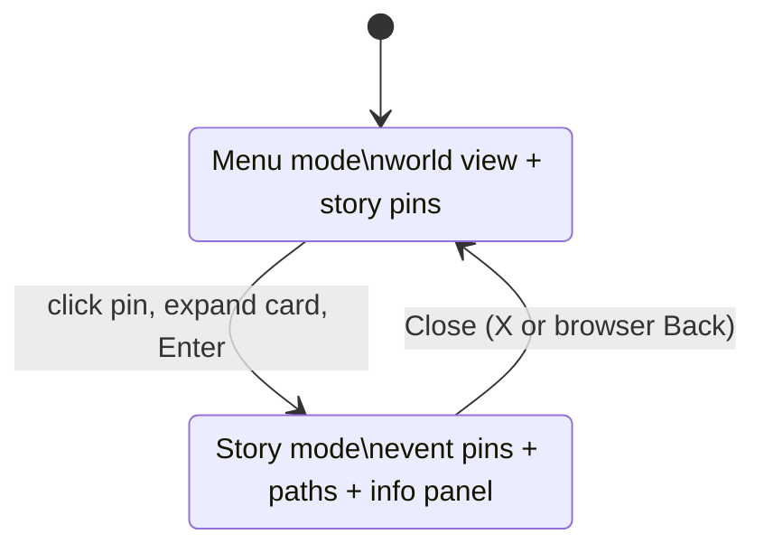

# Mercator — Design Spec (MVP)

- **Date:** 2026-06-12
- **Status:** Draft for review
- **Language:** English (per `CLAUDE.md`, in-repo technical docs are English-only).

> This spec supersedes the earlier 3-route (Home / Period / Story) draft. The MVP is
> a single interactive map screen. Product discussion with the maintainer happens in
> Russian; the committed spec stays in English.

---

## 1. Concept

**Mercator is an interactive historical atlas.** History is told through **stories**
(narrative chapters of an epoch); each story is a set of ordered **events** drawn on
a stylized world map.

The MVP lives on **one screen**: a single world map. Stories are pinned on it
geographically. Click a pin, the story expands into a card; "Enter" applies the
story and the map fills with its events (numbered pins + dashed voyage/campaign
paths). Click an event to read it. Close the story to return to the map of stories.

The edge over competitors (GeaCron, Running Reality, OpenHistoricalMap) is **premium
UX and an atmospheric map** where they offer raw GIS or academic dryness.

**Project priority:** speed to a working, deployed demo. Depth and "magic" are
layered in later.

## 2. MVP scope

**In scope:**
- One static Next.js app, no DB/API.
- A **single route** (`/`) with two modes on one persistent map: **Menu** and **Story**.
- **2 fully curated stories**, **5 events each**, spanning two epochs:
  - **Age of Discovery** (15–16th c.)
  - **World War II in Europe** (20th c.)
- Each event is a point pin; events optionally carry a **path** drawn as a dashed
  gold arc (used for all MVP events — they are voyages/campaigns).
- Event info panel (shadcn `Sheet`: right panel on desktop, bottom drawer on mobile).
- "Codex" dark-gold shadcn theme + recolored MapLibre map style.
- Basic responsiveness.
- Deploy to production (Vercel).

**Explicitly NOT in MVP:**
- Cinematic **autoplay** tour (deferred — manual navigation only).
- The `Period` level and `Home`/`Period`/`Story` routes (dropped).
- PostGIS/API · vector tile pipeline · borders/great-powers layer · RAG "Ask AI" ·
  accounts · monetization · programmatic SEO "at scale".

## 3. Navigation & app structure

Single route `/`. The app is a client-side state machine over one persistent map
instance. No full-page navigation between modes — the map is never torn down.



- The applied story is reflected in the URL as a **shallow query param**
  (`/?story=age-of-discovery`). This makes a story shareable and lets the browser
  **Back** button close the story. Reloading a deep link opens directly in Story mode.
- Selecting an event may also be reflected (`/?story=...&event=cortes`) so a specific
  event is linkable; this is a nice-to-have, not required for MVP.

## 4. Menu screen (Menu mode)

A full-screen world map in the "Codex" style.

- **Story pins** are placed at a representative geographic location (`Story.pin`).
  Collapsed state = a glowing gold dot with a small label.
- **Click a pin → the card expands in place** (anchored to the pin): cover image,
  epoch badge, title, 1–2 line summary, an "N events · year range" line, and an
  **Enter →** button.
- Clicking **Enter** applies the story (transition to Story mode).
- A lightweight app title/wordmark sits in a corner overlay.

## 5. Story screen (Story mode)

The same map, re-themed to the story.

- **Map fit:** on apply, `flyTo` the story's configured view and fit to its events'
  bounds. On close, `flyTo` back to the world view.
- **Event pins:** numbered `1..5` markers in event order. States: default ·
  active/selected (glowing, enlarged).
- **Paths:** each event's `path` is drawn as a **dashed gold arc** (GeoJSON line
  layer). The active event's path is emphasized; others are dimmed.
- **No inter-event connector line** for anthology stories (independent voyages):
  the per-event paths and numbered order carry the sequence. (A single continuous
  journey could instead use one connector; not needed for the two MVP stories.)
- **Event info panel:** clicking a pin (or a sequence chip) opens a shadcn `Sheet` —
  right panel on desktop, bottom drawer on mobile — with date · title · image ·
  body (markdown, 2–4 paragraphs) · sources.
- **Sequence strip** (bottom): chips `1..5`; click to jump to an event. Manual only,
  no autoplay.
- **Close (✕)** in a corner returns to Menu mode (also triggered by browser Back).
- **Accessibility:** with `prefers-reduced-motion`, map transitions are instant
  (no fly-overs).

## 6. Data model (static, no backend)

Each story is typed JSON in the repo; images live in `/public`. Schemas validated
with `zod` at build time. There is **no `Period` entity**; `epoch` is a label on the
story.

```ts
type Event = {
  id: string;                 // "cortes"
  order: number;              // 1..N sequence within the story
  year: number;               // numeric sort key (BCE = negative)
  dateLabel: string;          // "1519–1521"
  title: string;
  coords: [number, number];   // [lng, lat] — pin, label, click target (required)
  path?: [number, number][];  // optional voyage/campaign arc (drawn dashed gold)
  summary: string;            // short, for the on-map peek
  body: string;               // markdown, 2–4 paragraphs
  image?: string;
  sources?: { label: string; url: string }[];
};

type Story = {
  id: string;                 // "age-of-discovery"
  epoch: string;              // label only, e.g. "15–16th c."
  title: string;              // "Age of Discovery"
  summary: string;
  cover: string;              // image path
  pin: [number, number];      // story location on the menu map [lng, lat]
  yearStart: number;          // for the range label
  yearEnd: number;
  map: { center: [number, number]; zoom: number }; // view when applied
  events: Event[];            // exactly 5 for MVP
};
```

Layout: `content/stories/*.json`, images in `public/stories/<storyId>/`. At build,
Next.js reads the JSON and validates it with `zod`.

## 7. Map & rendering

- One **MapLibre GL JS** instance, custom "Codex" style (§8). The instance persists
  across Menu/Story modes.
- **Story pins (menu) and event pins (story) → HTML markers** (`maplibregl.Marker`):
  only ~2 and ~5 of them, easy to style and animate.
- **Voyage/campaign paths → GeoJSON line layers**: a single `LineString` source per
  story, added when the story is applied and removed on close; dashed gold paint,
  active path emphasized.
- **Transitions:** `flyTo` / `fitBounds` on apply and close; instant under
  `prefers-reduced-motion`.

## 8. Art direction — "Codex"

Dark-and-gold, serif headings, premium and epic. Implemented as a **shadcn token
theme** (CSS variables) + a recolored MapLibre style.

| Token | Value | Purpose |
|-------|-------|---------|
| `--background` | `#0d0b07` | warm near-black background |
| `--foreground` | `#e9dcc3` | parchment text |
| `--card` | `#14110b` | card/panel surfaces |
| `--primary` | `#e8c074` → `#c9952f` | gold (buttons, active accents) |
| `--primary-foreground` | `#160f02` | text on gold |
| `--muted-foreground` | `#9a886a` | secondary text |
| `--border` | `#2a2114` | borders |
| `--radius` | `~10px` | rounding |

**Fonts:** a serif display for headings (e.g. EB Garamond / Cormorant, fallback
Georgia); a system/Inter sans for controls and UI.

**Map style:** dark teal-navy land/water, muted, minimal labels; gold accents for
event pins and paths. The basemap is an open vector basemap recolored to "Codex"
(exact source — §12).

## 9. Tech stack

- **Next.js (App Router) + TypeScript**, fully static (SSG); single client route.
- **Tailwind CSS + shadcn/ui** (Sheet/Drawer, Button, Card, Badge, Tooltip). Compose
  existing components before writing new ones.
- **MapLibre GL JS** for the map (custom style).
- **zod** — content schemas and build-time validation.
- Lightweight **React state/context** for the Menu↔Story machine (no Zustand needed
  at this size).
- Deploy: Vercel (or Cloudflare Pages).
- All code, comments, and technical docs in English (see `CLAUDE.md`).

## 10. MVP content

### Story 1 — Age of Discovery (15–16th c.)

`pin`: western Iberia / eastern Atlantic. Events (each drawn as a path):

1. **1492 — Columbus reaches the Americas.** Palos → Canaries → Bahamas/Caribbean.
2. **1498 — Vasco da Gama reaches India.** Lisbon → around Africa → Calicut.
3. **1519–1521 — Cortés and the fall of Tenochtitlan.** Veracruz → Tenochtitlan
   (conquest march).
4. **1519–1522 — Magellan–Elcano circumnavigation.** First voyage around the globe.
5. **1532 — Pizarro and the conquest of Peru.** Coast → Cajamarca → Cusco.

### Story 2 — World War II in Europe (20th c.)

`pin`: central Europe. Events (each drawn as a directional path/arrow):

1. **1939 — Invasion of Poland.** Germany → Poland.
2. **1940 — Fall of France.** Through the Ardennes → Paris.
3. **1941 — Operation Barbarossa.** Eastern front advance into the USSR.
4. **1944 — D-Day landings.** Across the Channel → Normandy.
5. **1945 — Fall of Berlin.** Final Allied/Soviet advance → Berlin.

## 11. Success criteria

- One published URL in production.
- Both stories playable end to end via manual navigation: open from the menu, read
  all 5 events, close back to the menu.
- Menu ↔ Story mode (with URL deep-link + Back-to-close) works.
- Visually feels premium ("Codex"), not generic.
- Responsive (desktop + basic mobile, panel → bottom sheet).

## 12. Open decisions (deferred to implementation)

- Exact map basemap source (OpenFreeMap / MapTiler / self-hosted) and final MapLibre
  style.
- Whether to reflect the selected event in the URL (`&event=`) — nice-to-have.
- The specific serif font.
- Path fidelity: approximate few-waypoint arcs vs. more detailed routes.

## 13. Testing (light, suited to MVP)

- `zod` validation of all content JSON at build (+ a test that fails on a broken
  dataset, e.g. wrong event count or missing `coords`).
- Unit tests for story/event helpers: ordering by `order`, year sorting.
- Component tests: the event panel and the sequence strip (jump-to-event).
- Manual QA of map visuals, transitions, and the Menu↔Story flow.
